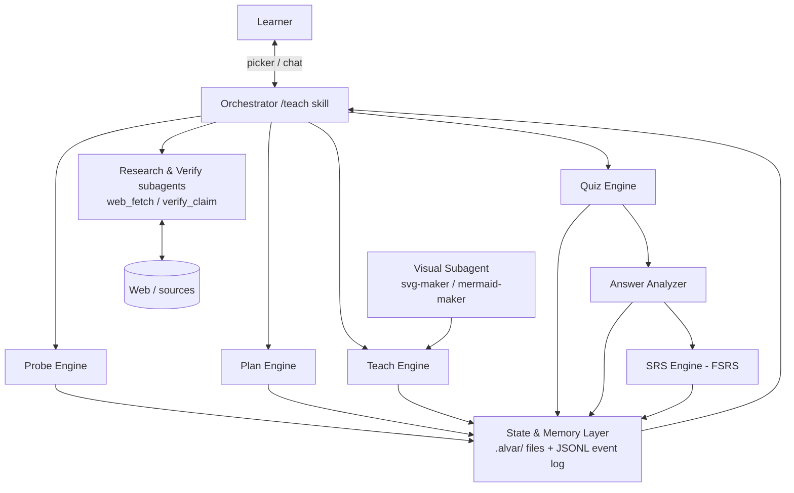
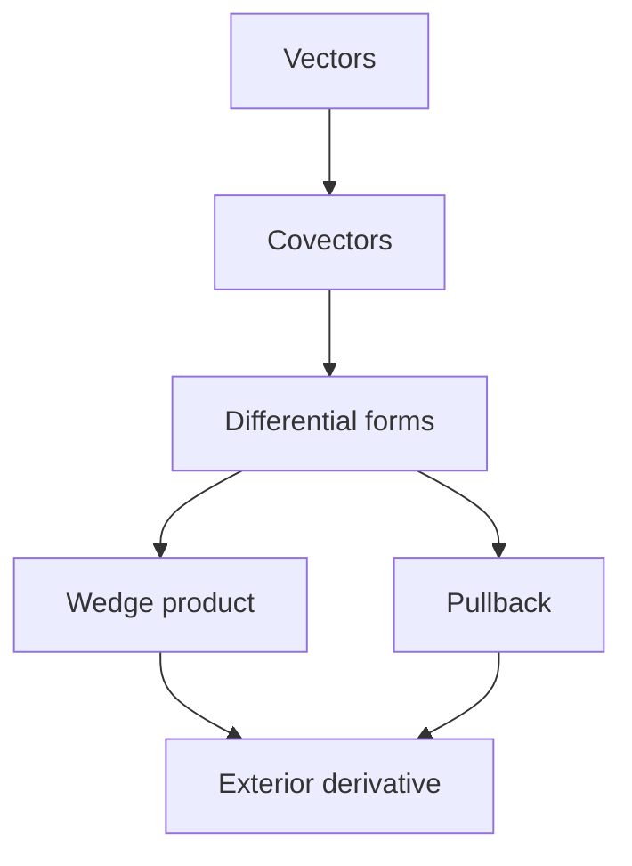

# The Learning Agent — Internal Architecture & Operations Design

> **Status:** Draft v1.0
> **Scope:** Internal workings of an agentic AI tutor — knowledge-gap detection, web research & verification, curriculum planning, quiz generation & analysis, spaced repetition, persistence, skills, and cross-agent enforcement.

---

## 1. Purpose & Design Principles

The system fixes two structural inefficiencies of traditional learning:

| Inefficiency | Consequence | Our Answer |
|---|---|---|
| **One outlet teaches many students** | A course can't align with *your* exact edge of understanding | Curriculum is computed per-learner, per-session |
| **One student learns from many outlets** | Cognitive switching costs; the brain hedges trust on unfamiliar sources | One teaching interface; trust is **engineered upfront** via automated verification |

**Design principles (non-negotiable):**

1. **Optimized teaching** — shape every lesson to the learner's precise current knowledge.
2. **Optimized allocation of mental resources** — the agent owns planning, sourcing, fact-checking, and note-keeping; the learner's effort goes *only* into the material.
3. **Nothing is taught unverified** — external claims must pass the verification pipeline before entering a lesson.
4. **Nothing is advanced unproven** — mastery is gate-locked by quizzes, not vibes (anti "self-gaslighting").
5. **One node at a time** — never dump a chapter; teach exactly one atomic reasoning step.
6. **Local-first, plain files** — all state lives in Markdown/JSONL readable by Obsidian and by any agent.

---

## 2. System at a Glance



**End-to-end flow of one session:** `GREET → PROBE → PLAN → TEACH ⇄ QUIZ → ANALYZE → (REMEDIATE) → WRAP → SRS schedule update`.

---

## 3. Agent State Machine & Internal Decision Loop

### 3.1 States

| State | Purpose | Exit condition |
|---|---|---|
| `GREET` | Load `LEARNER.md`, due SRS cards, resume point | Profile loaded |
| `PROBE` | Map the learner's knowledge edge (§4) | Every prerequisite strand probed |
| `PLAN` | Emit Mermaid DAG curriculum (§7) | DAG valid, ordered, grounded |
| `TEACH` | Teach exactly one node (§8) | Lock-in quiz issued |
| `QUIZ` | Interactive graded MCQ via picker | Answer recorded |
| `ANALYZE` | Score answer, update mastery posterior (§9.3) | Verdict: `pass` / `fail` / `needs-remediation` |
| `REMEDIATE` | Insert prerequisite node into overlay DAG (§9.5) | Remediation node mastered |
| `SRS_REVIEW` | Serve due cards first (§10) | Queue empty or learner stops |
| `WRAP` | Persist session, update `LEARNER.md`, schedule cards | Files written |

### 3.2 Decision loop (pseudocode)

```text
loop:
  state = current_state()
  case state:
    PROBE:    strand = next_unprobed_strand(dag)
              ask_mcq(strand, difficulty=binary_search_mid(strand))
              update_strand_posterior(strand, answer)
    PLAN:     dag = build_curriculum(probed_edges, learner_profile)
              assert is_acyclic(dag) and every_node_has_contract(dag)
    TEACH:    node = first_unmastered_node(topo_order(dag))
              teach(node)          # one node only
    QUIZ:     record = issue_lockin_quiz(node)     # via picker tool
    ANALYZE:  verdict = analyze(record, node)
              update_mastery(node, verdict)
              schedule_srs_card(node, rating=map_to_fsrs(verdict))
              if verdict == fail_with_misconception: goto REMEDIATE
              if verdict == pass: advance to next node
    SRS_REVIEW: serve_due_cards()   # always runs before new material
```

---

## 4. How the Agent Identifies Learner Knowledge Deficiency

The agent never assumes; it **measures**. Deficiency detection has three mechanisms:

### 4.1 Persistent ground truths (`LEARNER.md`)
Before any probing, the agent reads `.alvar/LEARNER.md`, which records established facts ("knows eigendecomposition", "confuses covariance/contravariance", pace, preferred voice). This prevents re-interviewing across sessions.

### 4.2 Binary-search probing over dependency strands
The topic is decomposed into **strands** (independent prerequisite chains). For each strand the agent issues graded MCQs through the **interactive picker tool** — never free-text:

- Start at a mid-difficulty question on the strand.
- Correct + confident → jump **harder**; wrong or shaky → go **easier** (binary search).
- 2–4 questions per strand is usually enough to locate the **edge of understanding**.

### 4.3 Continuous signals during teaching
Every quiz answer and every hesitation updates a per-node **mastery posterior** (§9.3). Nodes whose posterior drops below threshold are flagged `needs-remediation` and re-enter the loop.

**Output of PROBE:** a per-node map of `{mastered | partial | unknown}` — the input to PLAN.

---

## 5. How the Agent Identifies *Its Own* Knowledge Deficiency

The agent distinguishes **what it knows** from **what it merely believes**. Before teaching any node or making any empirical claim, it runs a self-check against a trigger matrix:

| # | Trigger | Example | Action |
|---|---|---|---|
| 1 | Claim is **time-sensitive** | "current best model", prices, versions | `web_fetch` + `verify_claim` |
| 2 | Claim is **empirical/named-source** | "Euler proved…", "paper X shows…" | `verify_claim` (2 independent sources) |
| 3 | Model expresses **uncertainty** | hedging language, low self-scored confidence | `web_fetch` |
| 4 | **Conflicting** internal knowledge | two plausible versions of a fact | `verify_claim`, mark `qualified` |
| 5 | Learner asks for **citation/source** | "where did you get that?" | `verify_claim`, attach provenance |
| 6 | Claim would be **taught as truth** but has **no provenance** in cache | any core node fact | block until verified |

Rule: **a claim without a verdict never enters a lesson.** This is the "fetch external info to update its knowledge" feature — implemented in §6.

---

## 6. Implementation: Web Fetch & Claim Verification

### 6.1 Two primitives

```text
web_fetch(query | url)
  → { title, url, published_at, extracted_markdown, content_hash, fetched_at }

verify_claim(claim, context)
  → { verdict: confirmed | qualified | contradicted | unknown,
      confidence: 0..1, citations: [ {url, quote, retrieved_at} ],
      checked_at }
```

### 6.2 `web_fetch` pipeline

1. **Acquire** — plain HTTP GET for static pages; headless-browser (Playwright) for JS-heavy pages; search-API call when given a query instead of a URL.
2. **Extract** — readability pass → clean Markdown (strip nav/ads/scripts).
3. **Cache** — store under `.alvar/cache/sources/<hash>.md` with metadata; hash-dedupe; TTL-based invalidation for time-sensitive topics.
4. **Provenance** — append a `source_fetched` event to the session JSONL so every fact is traceable later.

### 6.3 `verify_claim` pipeline (runs in a **researcher subagent**)

1. **Decompose** the claim into atomic, checkable statements.
2. **Fetch ≥ 2 independent sources** (never two pages citing the same origin).
3. **Compare** statements against sources; classify each.
4. **Emit the structured verdict** (enum above) + citations + confidence.
5. Parent agent attaches the verdict to the node/claim before teaching.

### 6.4 Subagent topology

| Subagent | Runs | Returns |
|---|---|---|
| `researcher` | async (tmux pane / background task) | `verify_claim` verdicts |
| `svg-maker` | on demand | diagram SVG, refined via critique loop |
| `mermaid-maker` | on demand | validated Mermaid DAG blocks |

Verdicts are **hard data**: the orchestrator must not paraphrase `contradicted` into "mostly true".

---

## 7. Curriculum Planning (PLAN)

### 7.1 Node contract
Every DAG node carries a contract the quiz engine will consume:

```yaml
node_id: forms.pullback
label: Pullback of a differential form
prerequisites: [forms.covector, manifolds.maps]
teaches: [pullback definition, coordinate formula]
misconception_tags: [pullback-not-pushforward]
quiz_blueprint: { recall: 1, application: 1 }
sources: [{claim: "...", verdict: confirmed, citation: "..."}]
```

### 7.2 DAG
The agent reasons over *this specific learner's* map and emits a **Mermaid DAG** before teaching anything:



- Validated: acyclic, all edges reference existing nodes, every node has a contract.
- **Canonical DAG is immutable** during a session; remediation happens in an *overlay DAG* (§9.5).

---

## 8. Teaching Loop (TEACH)

Per node, exactly:

1. **Frame** — 1–2 sentence motivation tied to what the learner already mastered.
2. **Explain** — the single reasoning step, using the learner's vocabulary from `LEARNER.md`.
3. **Visualize (if needed)** — spawn `svg-maker`; the subagent iterates (draw → self-critique → redraw) until the diagram isolates the concept.
4. **Check** — one quick comprehension question.
5. **Lock-in quiz** — mandatory graded MCQ via picker (§9). No advancement without a pass.

---

## 9. Quiz Engine: Generation, Analysis, Mastery, Remediation

### 9.1 Generation
Questions are generated **from the node contract**, not from the prose:

- ≥ 1 **recall** item and ≥ 1 **application/transfer** item.
- Distractors are built from the contract's `misconception_tags` — each wrong option corresponds to a specific, plausible error.
- Delivered through the **interactive picker tool** (selectable options, instant ✔/✘ + explanation), never as chat text.

### 9.2 Answer record (persisted per answer)

```json
{
  "question_id": "q-17",
  "node_id": "forms.pullback",
  "selected": "B",
  "correct": false,
  "confidence": "high",
  "response_time_ms": 8200,
  "misconception_tag": "pullback-not-pushforward"
}
```

### 9.3 Analysis: the confidence × correctness matrix

| | **High confidence** | **Low confidence** |
|---|---|---|
| **Correct** | Strong evidence of mastery | Fragile knowledge → schedule sooner (`Hard`) |
| **Wrong** | **Misconception** → targeted remediation | Ordinary gap or guessing → re-teach node |

The analyzer updates a per-node Bayesian mastery posterior and applies the **pass gate**:

> A node passes only if: posterior ≥ **0.85**, no critical misconception remains, **both** recall and application items succeeded, and confidence is not miscalibrated (e.g., lucky guessing pattern).

### 9.4 Rating → SRS mapping

| Evidence | FSRS rating |
|---|---|
| Severe misconception / failed | `Again` |
| Correct but uncertain, or slow | `Hard` |
| Correct and confident | `Good` |
| Effortless, transfers immediately | `Easy` |

### 9.5 Remediation = DAG backpropagation

On a misconception-tagged failure:

1. Mark current node `needs-remediation` (never just repeat the text).
2. Trace **prerequisite ancestors** of the failed node.
3. Select the **nearest unresolved prerequisite** that explains the tagged misconception.
4. Insert a **remediation node + edge** into the session **overlay DAG** (cycle-checked).
5. Teach + quiz the remediation node.
6. Re-test the original node; dissolve the overlay on mastery.

Threshold discipline: one lucky-guess error does **not** spawn a prerequisite; require repeated evidence or a critical misconception.

---

## 10. Spaced Repetition (FSRS)

**Algorithm: FSRS** (modern, better interval quality than SM-2/Leitner, tiny state). Each **node-mastery card** stores:

```json
{
  "node_id": "forms.pullback",
  "stability": 8.4,
  "difficulty": 5.8,
  "due_at": "2026-04-12T10:00:00Z",
  "last_rating": "good",
  "reps": 4,
  "lapses": 1
}
```

- **What gets scheduled:** node-mastery cards (one per taught node). Individual **facts** become cards only if they are important, independent, and repeatedly forgotten.
- **When reviews run:** every session opens with `SRS_REVIEW` — due cards are served *before* new material. Ratings come from the same picker quizzes (§9.4 mapping), so review and teaching share one measurement pipeline.
- **Where it lives:** `.alvar/review-queue.json`; updated atomically after every quiz.

---

## 11. Backend & Persistence

Local-first. No server required; plain files, Obsidian-compatible.

```text
.alvar/
├── LEARNER.md              # persistent profile: ground truths, pace, voice, known misconceptions
├── maps/
│   └── <topic>.md          # canonical Mermaid DAG + node contracts
├── sessions/
│   └── <date>-<topic>.md   # human-readable transcript + checkpoint summaries
├── events/
│   └── <session>.jsonl     # append-only machine log (see below)
├── visuals/                # generated SVGs, critique iterations kept
├── cache/sources/          # fetched documents, hashed, with metadata
└── review-queue.json       # FSRS card state
```

### 11.1 JSONL event log (append-only)

```json
{"t":"2026-04-12T10:00:00Z","event":"quiz_answered","node":"forms.pullback","correct":false,"confidence":"high","misconception":"pullback-not-pushforward"}
{"t":"2026-04-12T10:01:12Z","event":"claim_verified","claim":"...","verdict":"confirmed","citations":["https://..."]}
{"t":"2026-04-12T10:02:00Z","event":"dag_overlay_insert","node":"remed.covector-basis","parent":"forms.pullback"}
```

This log is the source of truth for resume, analytics, and audits; the Markdown files are the human-facing projection.

---

## 12. Module Breakdown

| Module | Responsibility | Key API |
|---|---|---|
| `orchestrator` | Owns the state machine (§3); invokes skills; sequence control | `run_session(topic)` |
| `probe-engine` | Strand decomposition, binary-search MCQ probing, edge localization | `probe(topic) → knowledge_map` |
| `plan-engine` | Builds & validates Mermaid DAG + node contracts; overlay management | `build_curriculum(map) → dag` |
| `teach-engine` | One-node exposition; requests visuals; triggers lock-in quiz | `teach(node)` |
| `quiz-engine` | Generates MCQs from contracts; renders via picker tool | `issue_lockin(node) → answer_record` |
| `analyzer` | Confidence×correctness scoring, posterior update, misconception tagging | `analyze(record, node) → verdict` |
| `remediator` | Backpropagation into overlay DAG (§9.5) | `remediate(failure) → overlay_ops` |
| `research/verify` | `web_fetch`, `verify_claim`, researcher subagents, source cache | `verify_claim(claim) → verdict` |
| `visual` | svg-maker / mermaid-maker subagents with critique loop | `make_visual(node) → svg` |
| `srs-engine` | FSRS scheduling, due-card queue, rating ingestion | `due_cards()`, `schedule(node, rating)` |
| `state/memory` | `LEARNER.md`, maps, sessions, JSONL event log; session resume | `persist(event)`, `load_profile()` |
| `ui/picker` | Interactive MCQ/option popups with a shared UI lock | `ask(mcq) → selection` |

**Codebase layout:**

```text
learning-agent/
├── skills/                 # SKILL.md packages (§13)
├── modules/                # the engines above (thin, provider-neutral)
├── schemas/                # JSON schemas: answer_record, verdict, node_contract, fsrs_card
├── adapters/               # claude-code/ | codex/ | opencode/ | pi/  (thin shims)
├── hooks/                  # runtime enforcement hooks (§14, layer 3)
└── tests/                  # fixture sessions + state-machine transition tests
```

---

## 13. `SKILL.md` — Skills That Define Tool Usage

Format: open **Agent Skills** standard — a folder per skill with `SKILL.md` (YAML frontmatter + instructions), optional `scripts/` and `references/`. Agents load only `name` + `description` at startup (~100 tokens) and pull the full body on activation.

### 13.1 Layout

```text
skills/
├── teach/SKILL.md          # orchestrates the whole loop (§3)
├── probe/SKILL.md          # binary-search probing rules
├── learn-verify/SKILL.md   # web_fetch + verify_claim rules
├── learn-visual/SKILL.md   # SVG/Mermaid subagent loop
└── review/SKILL.md         # FSRS review session rules
```

### 13.2 `skills/teach/SKILL.md`

```markdown
---
name: teach
description: >
  Run the full Alvar-style learning loop for any topic: probe the learner's
  edge, plan a Mermaid DAG, teach ONE node at a time, and lock in each node
  with a graded picker quiz. Use whenever the user asks to learn, teach, or
  study a topic.
allowed-tools: picker quiz web_fetch verify_claim spawn_subagent read write
---

## Instructions
1. GREET: read .alvar/LEARNER.md and .alvar/review-queue.json. Serve due cards first.
2. PROBE: for every prerequisite strand, ask 2–4 graded MCQs via the picker tool,
   binary-searching difficulty. Never accept free-text self-assessment as proof.
3. PLAN: emit a Mermaid DAG of unmastered nodes with node contracts. Validate acyclicity.
4. TEACH: exactly one node per turn. If a diagram is needed, spawn learn-visual.
5. QUIZ: end EVERY node with a lock-in quiz through the picker tool.
6. ANALYZE: apply §9.3 pass gate. On misconception-tagged failure, run remediation (§9.5).
7. Never advance on an unpassed node. Never teach a node whose facts lack a
   verification verdict. Persist every event to .alvar/events/<session>.jsonl.
```

### 13.3 `skills/learn-verify/SKILL.md`

```markdown
---
name: learn-verify
description: >
  Fact-check an empirical or time-sensitive claim against independent web
  sources before it is taught. Use before presenting any external fact as truth.
allowed-tools: web_fetch spawn_subagent read write
---

## Instructions
1. Decompose the claim into atomic statements.
2. web_fetch at least TWO independent sources (different origins).
3. Return a structured verdict: confirmed | qualified | contradicted | unknown,
   with citations, confidence, and checked_at.
4. Cache fetched documents under .alvar/cache/sources/. Log a claim_verified event.
5. NEVER fabricate a citation. 'unknown' means the claim is not teachable as truth.
```

### 13.4 `skills/probe`, `learn-visual`, `review` (abridged)

- **probe** — `allowed-tools: picker quiz read write`; rules: strand decomposition, binary search, never reveal the "correct" answer mid-probe, persist strand posteriors.
- **learn-visual** — `allowed-tools: spawn_subagent read write`; rules: spawn svg-maker, critique-and-refine until the diagram isolates the concept, save under `.alvar/visuals/`.
- **review** — `allowed-tools: picker quiz read write`; rules: serve due FSRS cards first, map outcomes via §9.4, never schedule new material before the due queue is cleared.

---

## 14. Enforcing the Skills & Rules Across *All* Agents

Instructions alone are not a boundary. Enforcement is **four layers**, so Claude Code, Codex, OpenCode, Pi, or Cursor all behave identically:

| Layer | Mechanism | What it enforces |
|---|---|---|
| **1. Skills** | `SKILL.md` frontmatter + body | *How* to use tools; `allowed-tools` restricts the toolset while a skill is active |
| **2. Repo-wide invariants** | `AGENTS.md` (root) | Hard rules every agent reads every session (below) |
| **3. Runtime hooks/policies** | PreToolUse hooks, `deny/ask` permission rules, opencode.json policies | Mechanically block bad transitions (e.g., deny `write` outside `.alvar/` without state-machine approval; require `claim_verified` event before lesson content citing external facts) |
| **4. Shared engine + CI** | Provider-neutral JSON schemas + state machine in `modules/`; CI lint | The state machine *rejects* invalid ops at runtime; CI validates SKILL.md frontmatter, schema conformance of event logs, DAG acyclicity, fixture-session replay |

**`AGENTS.md` invariants (excerpt):**

```markdown
# Learning Agent — non-negotiable rules
- Never teach more than ONE node per turn.
- Never advance without a passed lock-in quiz recorded in the event log.
- Never present an external claim as fact without a verify_claim verdict attached.
- Never conduct quizzes in free-text chat; always use the picker tool.
- Never edit canonical DAGs during a session; remediate via the overlay DAG only.
- Never skip the due-card review queue at session start.
- All state writes go to .alvar/ using the schemas in /schemas.
```

**Discovery paths (per runtime):** project `.claude/skills/`, `~/.claude/skills/` (global), `.opencode/skills/`, `~/.config/opencode/skills/`, Pi extensions dir, or plugin bundles — the same `skills/` folder is symlinked/copied into each, and `adapters/` contains only thin shims. Because every adapter delegates decisions to the **same state machine + schemas**, a rule change in one place propagates to all agents.

---

## 15. Failure Handling & Observability

| Failure | Behavior |
|---|---|
| `web_fetch` fails / no sources | Verdict = `unknown` → node fact is **not teachable as truth**; agent says so explicitly |
| Sources **contradict** | Verdict = `contradicted`; present the controversy honestly, mark node `qualified` |
| Session interrupted | Resume from last JSONL checkpoint (state machine is event-sourced) |
| Learner frustration signals | Slow answers, repeated failures → insert easier bridge node, slow pacing |
| Verdict stale (time-sensitive) | TTL on cache; re-verify on reuse |

**Metrics** (from the JSONL log): posterior-over-time per node, misconception frequency, FSRS retention rate, verification verdict distribution, session length vs. nodes mastered.

---

## 16. Example Session (compressed)

```text
GREET   → loads profile: "knows linear algebra; weak on tensors"; 3 cards due → review first
PROBE   → strands [vectors ✓, covectors ~, manifolds ✓] → edge located at covectors
PLAN    → emits DAG: covectors → forms → wedge → pullback → exterior derivative
TEACH   → node "covectors": 1 frame, 1 explanation, svg-maker diagram, check question
QUIZ    → picker MCQ: answer correct + high confidence → pass, FSRS "Good"
TEACH   → node "differential forms" …
QUIZ    → wrong + high confidence, tag "pullback-not-pushforward"
REMEDIATE → overlay inserts "covector basis change"; teaches, quizzes, re-tests → pass
WRAP    → session .md written, LEARNER.md updated, cards scheduled, log appended
```

---

## 17. Configuration & Extension Points

- `config.toml`: pass threshold (default 0.85), probe depth, FSRS parameters, source allowlist, TTLs.
- **New domains:** add node-contract templates per subject (math vs. history quiz blueprints differ).
- **New agents:** add an adapter shim; zero changes to modules/schemas.
- **Human-in-the-loop:** optional `ask` policy layer for risky operations (e.g., fetching non-allowlisted domains).

---

## 18. References

- Eero Alvar — *How I Use AI to Learn Things*: https://youtu.be/kzcI5F4tGiU
- Agent Skills spec: https://agentskills.io
- Alvarmethod (portable skill pack): https://github.com/vasanthsreeram/Alvarmethod
- FSRS scheduling algorithm: https://github.com/open-spaced-repetition/fsrs4anki
